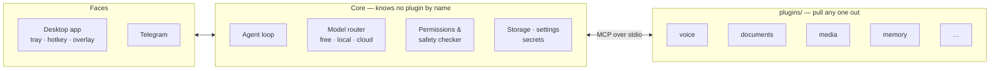

<p align="center">
  <picture>
    <source media="(prefers-color-scheme: dark)" srcset="./docs/readme/banner-dark.jpg">
    
  </picture>
</p>

<p align="center">
  <a href="https://github.com/cr3studioo/Alexia/releases/latest"></a>
  
  <a href="./LICENSE"></a>
  <a href="./docs/authoring/README.md"></a>
</p>

<p align="center">
  <a href="#get-alexia"><b>Download</b></a> ·
  <a href="#what-she-can-do">Plugins</a> ·
  <a href="#how-it-works">How it works</a> ·
  <a href="#where-it-is">Status</a> ·
  <a href="./docs/authoring/README.md">Write a plugin</a>
</p>

<br>

Alexia is a desktop AI assistant that lives in your tray, answers a hotkey, and does real work —
reads your documents, hears and speaks, controls the screen, remembers what you told it last
month, makes pictures on your own graphics card, and talks to you from Telegram.

It is built around one stubborn idea:

<p align="center"><i>A feature you cannot remove is not modular — it is permanent.</i></p>

Every one of those abilities is a **plugin**: a folder you can switch off, delete, or install
again, while Alexia is running, and nothing else notices. No dead menu item, no orphaned setting,
no crash. That is not a design goal. It is a check that runs on every commit.

<p align="center"></p>

## Why it exists

Three complaints about the assistants that came before it:

|   | The problem | What Alexia does instead |
|---|---|---|
| **1** | They talk, and that is mostly it. | Plugins add real capability; skills add the know-how to use it well. The gap between *"can't do that yet"* and *"can"* is one install. |
| **2** | They cost money you should not have to spend. | Free and local models first. With no keys, no sign-up and no Ollama, Alexia still answers — and that promise is a test, not a slogan. |
| **3** | They are monolithic. A voice feature was once bolted onto one and could never be taken out again. | A tiny core that is forbidden from ever naming a plugin. The check greps for it. |

And one thing it leads with: **setup**. Double-click, answer two plain questions, and you are
talking to it.

<p align="center"></p>

## Get Alexia

All downloads are on the [latest release](https://github.com/cr3studioo/Alexia/releases/latest).

| | Download | Then |
|---|---|---|
| **Windows** (x64) | `Alexia_x.y.z_x64-setup.exe` | Run it. |
| **macOS** — any Mac, Apple Silicon or Intel | `Alexia_x.y.z_universal.dmg` | Open it and drag Alexia into Applications. |

macOS 11 or later.

> [!NOTE]
> Neither build is code-signed yet, so the first launch meets a warning:
>
> - **Windows** — SmartScreen: choose **More info → Run anyway**.
> - **macOS** — macOS says it cannot verify Alexia. Press **Done**, open **System Settings →
>   Privacy & Security**, scroll down and press **Open Anyway** beside Alexia. Only the first
>   time.
>
> Alexia still verifies its own signature on every update it installs, and it updates itself in
> place when a new version is out.

First run takes about two minutes:

1. **What should I call you?** — one field, skippable.
2. **How should I run?** — *Local* (the model runs on this machine, ~5 min download), *Combined* (the default), or *Cloud*.
3. **Connect a model** — a free tier with no card, a key you already have, or your existing Claude Code login.
4. **Talk.** The tray icon appears (the menu bar, on a Mac) and the hotkey is shown once.

No account, no email, no tour.

<details>
<summary><b>Run it from source</b></summary>

<br>

Needs **Node 24+** and **pnpm 10**. The desktop shell also needs **Rust** (Tauri 2).

```bash
pnpm install
pnpm start        # core + UI in the browser — prints "Alexia is at http://127.0.0.1:…"
pnpm app          # build the desktop app (tray, hotkey, overlay)
pnpm check        # lint, typecheck, unit tests and the invariant checks
```

</details>

<p align="center"></p>

## What she can do

Nothing ships inside the installer. Alexia arrives able to hold a conversation, and every
capability below is a download from the **Plugins** screen — first-party plugins on exactly the
same footing as anybody else's.

| Plugin | What it does |
|---|---|
| 🎙️ **Voice** | Hears you with Whisper and answers out loud — with Piper, Qwen3-TTS, or a voice cloned from a clip of your own. |
| 📄 **Documents** | Reads what you hand it: PDF, Word, Excel, PowerPoint, OpenDocument, EPUB, web pages, notes and code. |
| 🖼️ **Local media generation** | Makes pictures, sound and video on your own machine with ComfyUI — and shows the picture forming as it works. |
| 🖱️ **Computer control** | Sees the screen, moves the mouse, presses things and types. Anything a person at the keyboard could do. |
| 🧠 **Long-term memory** | Remembers across conversations, and draws what it knows as a map you can explore. |
| ✈️ **Telegram** | Talk to Alexia from your phone. Every reply says that it crossed Telegram's servers. |
| 🔤 **Text in pictures** | Reads the words in a scan, photo or screenshot, using the OCR built into Windows and macOS. |
| 🎭 **Personality** | Write Alexia a personality in your own words, keep as many as you like, switch between them. |
| ✅ **Commitments** | Keeps track of what you said you would do — and whether you did. |
| 💻 **Claude Code** | Hands a coding job to the Claude Code CLI you already have, using your own login. |

Beside plugins there are **skills** — plain-language instructions that teach Alexia how to do
something well with the tools it already has — and **personas**. Alexia can also turn a task it
has done the expensive way into a learned skill, so the next time is cheap.

<p align="center"></p>

## How it works



- **A plugin is an MCP server with a manifest beside it.** Core is the MCP client. Each plugin
  runs in its own process, is started only when needed, and is shut down when idle — so one that
  crashes, hangs, or vanishes mid-task is contained, and the agent re-plans around it.
- **Plugins describe their screens; core draws them.** A plugin declares its settings page and
  control panel from a small set of widgets, so it never ships its own pixels, and when it is
  removed its screens go with it.
- **The model router picks per request** across free tiers, local models through Ollama, your own
  keys and Claude Code — with fallback when a free model is rate-limited, a spend preview before
  anything costs money, and outgoing text redacted before it reaches a free model.
- **Every step is visible.** The agent loop shows its trace as it works, asks before anything
  risky, and can be stopped mid-step.
- **A plugin version is a GitHub Release.** Publishing one is cutting a release; it then shows up
  on the Plugins screen of every Alexia that can run it.

<p align="center"></p>

## Where it is

Alexia is young — started in late August 2026 — and moves quickly. The latest release is on
the [Releases page](https://github.com/cr3studioo/Alexia/releases); the full, honest board is
in [`plan.md`](./plan.md).

| Milestone | | |
|---|:---:|---|
| **M0** — The skeleton | ✅ | Delete a plugin while Alexia runs, and nothing else notices |
| **M1** — Core minimum | ✅ | Storage, sessions, model router, first-run flow, slash commands |
| **M1.5** — The agent loop | ✅ | Multi-step tasks on a free model, every step visible, stop works |
| **M2** — Voice | ✅ | Install → talk → delete leaves no residue, and core unchanged |
| **M3** — The plugin library | ✅ | Registry, conformance suite, author docs, skills marketplace |
| **M4** — Contract generality | ✅ | Voice, Telegram and computer control with no special-casing in core |
| **M5** — The app | ✅ | Tauri shell, tray, hotkey, overlay, automatic updates |
| **M6** — The control surface | ✅ | Control view, trace, command palette, plugin panels |
| **M7** — What version 1 knew | ✅ | Egress redaction, cost tracing, memory that captures by itself |
| **M8** — Contract follow-through | 🟡 | Multiple conversations and per-plugin settings done; model preferences to go |
| **M9** — Local media, as a product | 🟡 | Built; the end-to-end first-time run is still to be proven |

**Still ahead:** a code-signing certificate, the cold-install tests with a real, non-technical
person in front of it (timed, and nobody helps), and somebody outside the project building a
working plugin from the docs alone.

> [!IMPORTANT]
> **Writing a plugin?** The contract froze at `alexia_protocol` 2 and has only grown since —
> Alexia currently accepts manifests declaring 2 through 7. Until 1.0 it can still change
> between releases; when it does, an old plugin stops loading with a sentence explaining why,
> never a crash.

<p align="center"></p>

## Write a plugin

```bash
npm create @alexia/plugin     # four questions and a folder that runs
npx @alexia/conformance .     # the same suite review runs
```

Then in Alexia: **Plugins → Add a plugin**, and paste the folder's path. The guide lives in
[`docs/authoring`](./docs/authoring/README.md) — manifest, tools, settings, storage,
lifecycle, skills and publishing.

## Read further

| | |
|---|---|
| [`Alexia.md`](./Alexia.md) | What is being built and why — the source of truth |
| [`plan.md`](./plan.md) | How, in what order, and what is done |
| [`questions.md`](./questions.md) | What is still open |
| [`docs/spec`](./docs/spec) | The contract: [wire protocol](./docs/spec/wire-protocol.md), [manifest](./docs/spec/manifest.md), [capabilities](./docs/spec/capabilities.md), [storage](./docs/spec/storage.md), [UI schema](./docs/spec/ui-schema.md), [skills](./docs/spec/skills.md), [versions](./docs/spec/versions.md) |
| [`docs/spec/invariants.md`](./docs/spec/invariants.md) | The checks that hold the code to the idea, run on every commit |
| [`docs/design.md`](./docs/design.md) | The visual language — cobalt and champagne |

<p align="center"></p>

## Licence

**Split, deliberately.** The app is copyleft so nobody repackages it as the closed subscription
product it was built in reaction to; the plugin SDK is permissive so nobody needs legal advice to
write a plugin.

| What | Licence |
|---|---|
| Alexia itself — core, UI, shell, app | [AGPL-3.0](./LICENSE) |
| `packages/protocol`, `packages/sdk`, `packages/conformance`, `packages/create-plugin` | Apache-2.0 (each carries its own `LICENSE`) |

**If you are writing a plugin, Apache-2.0 is the one that applies to you.** Your plugin is your
own code under your own licence; nothing here reaches into it.
