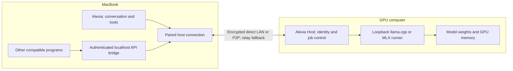

# Alexia remote GPU research

Researched 2 October 2026. This is a research and product proposal, grounded in the current worktree and primary project documentation. No remote host was installed or paired, and no two-machine latency benchmark was performed. Product recommendations and performance targets below are proposals, not verified runtime results.

**The requested experience is feasible:** run a companion on a GPU computer, pair it with Alexia, choose that computer when entering Local mode, and stream answers back to the MacBook. Keep the entire model and its inference on the GPU computer. Alexia keeps the conversation, tools, files, and interface on the MacBook; the host receives the context needed for inference and returns text or tool calls. Compatible third-party programs can use a local API bridge on their own machine.

The closest existing open-source product is **NVIDIA Personal AI Router (PAIR)**. The clearest precedent for internet connectivity embedded in an application is **LM Studio LM Link**, which uses Tailscale. My recommendation is to evaluate PAIR with Ollama for a ready-made LAN setup, then implement an Alexia Host using Alexia's existing runners, authenticated LAN connections, and an embedded peer-to-peer transport for the complete pairing-code experience across networks. Iroh is the strongest candidate investigated for that account-free transport; Tailscale remains a practical optional integration.

“Free” can mean no software subscription or per-token fee on hardware you already own. Electricity, hardware, release operations, and any hosted discovery/relay service still have costs. A free relay tier cannot guarantee unlimited capacity or availability.

**PAIR already implements much of the proposed workflow.** Its Apache-2.0 project supports mixed Windows, Linux, and macOS nodes, installs or adopts Ollama and LM Studio, and routes complete inference requests. It does not combine the machines' GPU memory. [PAIR release README](https://github.com/NVIDIA/Personal-AI-Router/blob/v0.1.1/README.md)

The latest release returned by GitHub's releases API during this research was **v0.1.1, published 28 August 2026**. Its asset inventory includes x64 and arm64 Windows `.exe` installers and macOS `.dmg` files, plus Debian packages. This establishes that installers exist; it does not establish that they run correctly on the user's specific hardware. [Release v0.1.1](https://github.com/NVIDIA/Personal-AI-Router/releases/tag/v0.1.1)

PAIR's documented setup is to install it on both computers, invite a discovered node, enter a six-digit PIN on the invited computer, prepare a model on the serving node, and point applications at the requesting computer's localhost proxy. It can expose an endpoint even when only a remote node runs the engine. Defaults are `11434` for the Ollama proxy and `1234` for the LM Studio proxy; the Endpoints window reports the actual port. [PAIR getting started](https://github.com/NVIDIA/Personal-AI-Router/blob/v0.1.1/docs/getting-started.mdx)

Its networking is **LAN discovery through mDNS, followed by direct HTTP services with mutual TLS for inference between paired nodes**. There is no embedded Tailscale or internet rendezvous in the documented architecture. Desktop routing is automatic; terminal controls can prefer a node. That preference can still fall back, so it does not provide Alexia's proposed strict “only this computer” choice. Routing also omits model warmness and measured latency. [PAIR architecture](https://github.com/NVIDIA/Personal-AI-Router/blob/v0.1.1/docs/architecture.mdx), [terminal controls](https://github.com/NVIDIA/Personal-AI-Router/blob/v0.1.1/docs/terminal-interface.mdx)

The pairing bootstrap and some telemetry are plaintext, although paired inference uses mutual TLS. Its security policy treats the PIN as a convenience bootstrap and assumes a trusted network. An internet-ready Alexia implementation should authenticate the initial key exchange as well as later inference. [PAIR security policy](https://github.com/NVIDIA/Personal-AI-Router/blob/v0.1.1/SECURITY.md)

For a simple PAIR evaluation, put the chosen model on the GPU host only. Requests naming that model should then go there; confirm the serving computer in PAIR's Jobs view. This is a useful evaluation arrangement, not a replacement for an explicit host selector. Adding Tailscale and manually supplying a private address is a plausible WAN experiment, but **PAIR-over-Tailscale interoperability has not been established here**. Address selection, firewall rules, and peer services need testing; mDNS discovery must not be assumed to cross the overlay automatically.

**LM Link demonstrates the embedded Tailscale approach.** LM Studio presents remote models in its model loader and lets other programs use them through the requesting machine's `localhost:1234` server. Its own backend receives device-discovery information; prompts and responses travel between the devices over encrypted connections. [LM Link](https://lmstudio.ai/link)

Tailscale's technical announcement identifies **tsnet**, its userspace Go library, as the embedded component. This explains how a desktop app can offer private networking without requiring a separately configured system-wide VPN. [Tailscale's LM Link announcement](https://tailscale.com/blog/lm-link-remote-llm-access)

The current pricing page lists **LM Link for up to five devices in the $0 plan**. However, the Link landing page still describes preview access and future free/paid plans. Treat availability and limits as something to confirm in the actual onboarding flow. LM Studio's desktop app has proprietary terms, so this is a product to integrate through its API and learn from, rather than an open-source host implementation. [Current pricing](https://lmstudio.ai/pricing), [app terms](https://lmstudio.ai/app-terms)

Other projects solve different portions of the problem:

| Project | What it supplies | Fit for Alexia's requested experience |
| --- | --- | --- |
| **Ollama** | MIT-licensed inference server and desktop distribution. Local API needs no authentication by default; network binding is configurable. | Easy existing remote engine, but Alexia must provide pairing, encrypted access, and host selection. Disable its cloud features for a strictly owned-hardware setup. [License](https://github.com/ollama/ollama/blob/main/LICENSE), [authentication](https://docs.ollama.com/api/authentication), [configuration](https://docs.ollama.com/faq) |
| **llama.cpp / llama-server** | MIT-licensed engine, compatible chat API, streaming, API-key authentication, tool-call templates, GPU backends. | Best default engine to reuse from Alexia's current work. Needs a companion and transport around it. [Server documentation](https://github.com/ggml-org/llama.cpp/blob/master/tools/server/README.md), [license](https://github.com/ggml-org/llama.cpp/blob/master/LICENSE) |
| **Jan** | Apache-2.0 desktop project with a configurable local API server and custom remote endpoints. | Another existing host/client option; its documented connection is a URL and optional API key, rather than the requested cross-machine pairing flow. Leave server-side tool execution off when Alexia owns tools. [Project overview](https://www.jan.ai/docs/desktop), [API server](https://www.jan.ai/docs/desktop/api-server), [custom endpoints](https://www.jan.ai/docs/desktop/remote-models/custom-endpoint) |
| **LocalAI** | MIT-licensed engine with multiple inference backends. Its P2P federation joins peers with a shared token using libp2p/EdgeVPN and routes whole requests to workers. | Relevant open-source networking reference. P2P federation is documented as experimental/tech preview, and a shared network token is a different trust model from per-device pairing and revocation. [Project](https://github.com/mudler/LocalAI), [P2P documentation](https://localai.io/docs/features/distribute/index.print.html) |
| **GPUStack** | Apache-2.0 cluster manager for inference infrastructure. | More appropriate for a managed GPU fleet. Version 0.7 had desktop installers and token-based worker enrollment; current documentation requires Linux GPU workers, Docker, and accelerator runtimes. Do not assume the older Mac/Windows worker support applies to the latest release. [License](https://github.com/gpustack/gpustack/blob/main/LICENSE), [older installer](https://docs.gpustack.ai/0.7/installation/desktop-installer/), [current quickstart](https://docs.gpustack.ai/latest/quickstart/) |
| **exo** | Apache-2.0 distributed model inference, automatic discovery, compatible APIs, and a macOS DMG. The documented app requires macOS 26.2+. | Useful when a model needs several machines' memory, especially fast linked Macs. Adds distributed-compute complexity that a single remote GPU host does not need. Current README is internally inconsistent about Linux GPU readiness; verify it before planning Linux acceleration. [exo](https://github.com/exo-explore/exo) |
| **llamafile** | Apache-2.0 packaging of an engine and optionally weights into one executable. Its documentation notes a 4 GB Windows executable limit and an external-weights alternative. | Useful packaging precedent; a single executable alone does not supply pairing, discovery, or host controls. [llamafile](https://github.com/mozilla-ai/llamafile) |
| **llama.cpp RPC** | Exposes remote accelerator devices and can distribute model computation and memory. Upstream calls it a fragile, insecure proof of concept. | A separate advanced option for splitting a model. Prefer complete remote inference for this product: it avoids network traffic inside the compute loop. [RPC documentation](https://github.com/ggml-org/llama.cpp/blob/master/tools/rpc/README.md) |

These are inference APIs, not a universal remote GPU driver. Programs that can select a compatible model endpoint can use them. Other GPU workloads, such as rendering or image generation, need their own supported remote job API and backend.

**The network transport and model server are separate choices.** A VPN or P2P library makes the other computer reachable; it does not run the model, select its settings, or decide where Alexia executes tools.

| Connection method | Speed and behavior | Free/open-source considerations | Recommendation |
| --- | --- | --- | --- |
| **Direct LAN, Ethernet or Wi-Fi** | Fewest network hops. Discover locally, then use an authenticated encrypted connection. | No hosted service required for local discovery and inference. | Default when both machines are nearby. Prefer Ethernet for consistency. |
| **Tailscale / embedded tsnet** | Attempts direct encrypted peer connections; DERP or peer relays handle networks that prevent direct access. | Personal plan currently includes six users, unlimited user devices, and 50 tagged resources; explicitly non-commercial. tsnet source is BSD-3-Clause, while hosted coordination remains a service dependency. | Quick optional remote-access path; account/tailnet enrollment remains necessary. [Connection types](https://tailscale.com/docs/reference/connection-types), [pricing](https://tailscale.com/pricing), [tsnet](https://tailscale.com/docs/features/tsnet), [source license](https://github.com/tailscale/tailscale/blob/main/LICENSE) |
| **Headscale with Tailscale clients** | Self-hosted coordination for a Tailscale-style network. | BSD-3-Clause project; infrastructure and administration are ours. | Suitable if self-hosting and an existing tailnet are wanted. More machinery than a two-device app pairing flow. [Headscale](https://github.com/juanfont/headscale) |
| **NetBird** | WireGuard overlay, discovery, access controls, and relay fallback. | Self-hostable. Client code is mostly BSD-3-Clause; management, signal, relay, and combined components use AGPLv3. | Credible VPN alternative, especially for managed networks. It still needs enrollment and management infrastructure. [NetBird](https://github.com/netbirdio/netbird), [license boundaries](https://github.com/netbirdio/netbird/blob/main/LICENSE) |
| **Embedded iroh** | Authenticated QUIC connections by public-key identity, NAT traversal, and relay fallback. | MIT/Apache-2.0 library and self-hostable relay code. Community relays cost $0 but are rate-limited without uptime guarantees. | Best candidate investigated for a native, account-free Alexia connection. Alexia still implements pairing, authorization, and its API bridge. [Iroh](https://github.com/n0-computer/iroh), [transport docs](https://docs.iroh.computer/), [relay pricing](https://www.iroh.computer/pricing) |
| **WebRTC data channels** | ICE selects a working route using candidates, STUN, and TURN; data channels can stream bidirectionally. | Open standards and open implementations, but signaling and TURN infrastructure still have to exist. | Prefer if a browser-only client becomes a requirement. Native applications can use a simpler transport integration. [WebRTC connectivity](https://developer.mozilla.org/en-US/docs/Web/API/WebRTC_API/Connectivity) |
| **Magic Wormhole / Fowl** | Human-readable codes bootstrap encrypted P2P connections; Dilation/Fowl can carry network streams. | Open-source ecosystem with rendezvous and relay implementations. | Strong pairing reference and possible tunnel experiment. Persistent device identity and inference lifecycle need additional work. [Wormhole's protocol overview](https://magic-wormhole.readthedocs.io/en/latest/welcome.html) |
| **SSH tunnel** | Forwards a local port to a host's loopback server. | Can use existing SSH access and keys. | Useful developer or advanced-user fallback; setup does not match the requested consumer pairing flow. |
| **Cloudflare Tunnel** | Connects through an intermediary rather than guaranteeing a direct device path. | Quick Tunnels have no uptime guarantee and explicitly do not support SSE. | Avoid Quick Tunnels for Alexia's streamed chat API. A configured production tunnel is a different option, requiring separate evaluation. [Quick Tunnel limits](https://developers.cloudflare.com/tunnel/get-started/quick-tunnels/) |

For the same two machines, Tailscale and iroh should be evaluated on **whether they establish a direct route**, connection recovery, and integration cost. There is no evidence here that one is universally faster. Both can require relays behind restrictive NAT/firewalls. No pairing-code design can guarantee direct connectivity across every network without a fallback service.

**Streaming is already the right method for fast output.** Send one inference request and keep its response stream open. Tokens travel back as the host generates them; there is no new request/response round trip for every token. SSE over a persistent HTTP connection is adequate for text. WebSockets or QUIC do not by themselves make the model generate faster. Real-time audio would need an appropriate audio protocol and a separate latency budget.

The useful latency breakdown is:

```text
Time to first visible output ≈ connection setup + request upload + network RTT
                            + host queue + model load + prompt processing
                            + first decode + bridge/render buffering
```

On a reused connection, connection setup largely disappears. Keep the selected model warm, avoid a new handshake per turn, forward stream chunks immediately, and keep the UI from buffering whole paragraphs. A large prompt or uploaded image can make request transmission important. Keeping a model warm avoids a cold load, not the cost of reading a long new prompt. Ollama documents preloading and configurable keep-alive behavior. [Ollama model lifecycle](https://docs.ollama.com/faq)

An illustrative bandwidth calculation, **not a benchmark**: at 50 tokens/second and an assumed 200–500 bytes per streamed token event, the response is approximately 10–25 KB/second. Text output is therefore unlikely to exhaust a normal network link. Packet delay, loss, queueing, and GPU speed matter more. Images, audio, model downloads, and large histories can change that conclusion.

For planning only, a healthy LAN might add single-digit to low-tens-of-milliseconds delay, while a remote internet path might add tens or hundreds of milliseconds depending on location and route. These are expectations to measure, not guarantees. Once streaming begins, throughput should stay close to the host's own throughput if neither transport nor client buffers the output. A slower model can still feel slow on a fast LAN; a stronger remote GPU can outweigh network overhead. Tool-heavy tasks pay the network cost again for each new model step.

**Networking does not inherently reduce model accuracy.** It changes where computation runs. Accuracy depends on the selected weights, quantization, context, templates, sampling, and backend behavior. A bigger GPU may let us choose a stronger model or higher precision, but that is a separate model-quality decision. Do not promise identical text across different GPU backends merely because the model name and seed match.

The host should advertise the actual model artifact/revision, quantization, effective context limit, engine version, and verified capabilities. An “OpenAI-compatible” label alone does not prove tool calling or image support. Alexia should validate ordinary answers, streamed tool-call assembly, context handling, and representative user tasks. Keep strict host selection and disclose any change of model instead of silently substituting a smaller model to achieve better speed.

**The proposed Alexia workflow is:**

1. Open **Alexia Host.exe** on Windows or **Alexia Host.app** from a DMG on macOS. It reports its GPU, available memory, storage, and whether acceleration is actually usable. Reuse an existing model or download one on this host with visible progress.
2. Select **Pair a device**. The host shows a short-lived code and optionally a QR code. Alexia accepts that code under **Local → Another computer**. The user can see both device names when approving the pairing on the host.
3. Alexia remembers that computer's cryptographic identity. Future connections need no repeated PIN, account, IP address, or port entry. Renaming the host or changing its network address does not create a new identity.
4. Whenever Local mode is selected, offer **This MacBook**, each paired computer, and **Pair another computer**. Remember the last selection, but keep the choice accessible. Display offline hosts and the reason they cannot currently serve rather than making them disappear.
5. Choose a model from the selected computer. Downloads and fit checks happen there. Alexia can show **Desktop · selected model · GPU · ready/loading/busy · direct/relay** and measured response speed.
6. Other compatible programs use a localhost endpoint on the MacBook, such as `http://127.0.0.1:<assigned-port>/v1`, plus a per-application key. The host runs the inference behind that bridge. Give users a copyable URL and model ID; do not assume port `1234` or `11434` is available.
7. If the selected host sleeps, disconnects, or rejects the request, show that state and offer an explicit switch. Local mode must not quietly send the request to a paid or public cloud provider. Switching away releases this client's request/load lease; it must not stop another client's active inference.

The screen text and settings above are proposed product behavior; they do not exist in the current Alexia worktree.



A returned tool call is still executed by Alexia on the MacBook under Alexia's normal controls. The GPU host is not automatically granted access to the MacBook's files or desktop. Prompt context and tool results sent for inference are visible to the host, so its owner is a trusted party even if the network transport is end-to-end encrypted. Where practical, host diagnostics retain timings rather than prompts.

**A pairing code needs a secure bootstrap, not just a lookup table.** Proposed design: use an established password-authenticated key exchange (PAKE), a single-use session with a short expiry, bounded attempts, and host approval. Bind the exchanged long-lived identities to the authenticated transcript. A QR invitation can carry a high-entropy secret; a manually typed code needs protection against offline guessing and repeated online guesses. Magic Wormhole demonstrates this pattern with SPAKE2 and human-sized codes. [Wormhole pairing](https://magic-wormhole.readthedocs.io/en/latest/welcome.html)

After pairing, use pinned identities and per-device authorization, with revoke/forget controls and secrets in the OS credential store. Iroh authenticates endpoint keys, but **knowing an endpoint key is not permission to run inference**: the host must enforce the paired-device allowlist and allowed operations.

On a LAN, local discovery can locate a candidate without internet access; discovery is not proof of identity. For a code alone to locate a computer across the internet, Alexia also needs a rendezvous service or an invitation that conveys enough addressing information. Store temporary rendezvous entries, authenticate key exchange, and expire them. Use direct P2P whenever possible and encrypted relays when necessary. These services carry discovery or ciphertext, not a hosted model. Account-free is feasible; infrastructure-free across all networks is not a credible guarantee.

**Alexia has useful building blocks, but several local-only assumptions must change.** This is based on the existing, modified worktree, not just the README.

| Current component | Evidence in the worktree | Required integration |
| --- | --- | --- |
| Provider and streaming | [`provider.ts`](../packages/core/src/provider.ts) sends streamed chat requests, parses SSE, supports tools/cancellation, and has a `prepare()` hook returning an endpoint, credential, and release callback. | A remote provider can use the same chat protocol. Add host readiness/authentication and cancellation without buffering the stream. Measure total startup too: current chat timing begins after preparation. |
| Managed runners | [`localRunners.ts`](../packages/core/src/localRunners.ts) checks local installed files and coordinates local engine leases. [`llama.ts`](../packages/core/src/llama.ts) starts an authenticated loopback server. | Reuse runner management on the GPU host. Keep remote inventory separate; remote models must not require file paths on the MacBook. Lease ownership must distinguish clients. |
| Placement and catalog | [`router.ts`](../packages/core/src/router.ts) treats local placement as this machine's pool. [`catalog.ts`](../packages/core/src/catalog.ts) describes T0 as local. [`ollama.ts`](../packages/core/src/ollama.ts) fixes Ollama's host to loopback. | Add explicit execution location and trust metadata. A loopback proxy can route remotely, so its URL must not be used as proof that inference stays on this computer. Do not silently repurpose current Ollama/T0 entries. |
| Mode switching | [`modeTransition.ts`](../packages/core/src/modeTransition.ts) selects installed files and checks this machine's runtime/memory before loading. | Select `{hostId, modelId}` and delegate availability/fit/load to that host. Use this machine's checks only for the “This MacBook” choice. Commit mode after remote readiness is confirmed. |
| Picker and transitions | [`local-models.ts`](../packages/ui/src/local-models.ts), [`mode-transition.ts`](../packages/ui/src/mode-transition.ts). | Add host selection, pairing, host-specific inventories, remote download progress, connection state, and an explicit disconnection/switch flow. |
| GPU policy | [`runnerBackend.ts`](../packages/core/src/runnerBackend.ts) has Metal, CUDA, CPU, and opt-in Vulkan policies. | Probe the host itself and report actual acceleration. An unsupported driver or CPU fallback must be visible; having installed a companion does not prove GPU inference works. |
| Shell, credentials, packaging | [`secrets.ts`](../packages/core/src/secrets.ts), [`src-tauri`](../src-tauri/tauri.conf.json), [`macOS packaging`](../src-tauri/tauri.macos.conf.json), [`sidecar.mjs`](../scripts/sidecar.mjs). | Reuse credential storage and packaging patterns for a separately identified Host application. Bundle the required runtime so users need no development tools. Packaging patterns are reusable; a Host build is not currently present. |

A model's identity should include host plus artifact, not its friendly name alone. Persist paired-host identity, display name, transport preferences, selected model, and allowed operations. Store remote credentials in the credential store. Do not mix another computer's installed paths or memory budget into this machine's installed-model registry.

The remote API needs more than `/v1/chat/completions`: an authenticated capability/model listing, model preparation, job status, cancellation, and client leases. Keep administrative model-download/delete operations scoped separately from inference. A user who wants to use an already-running Ollama, Jan, or LM Studio server can pair the companion that fronts it. A user with nothing installed can use the managed Alexia runner. Both cases should reach the same host selector and localhost bridge.

**The recommended implementation sequence preserves the full requested destination:**

1. Evaluate the released PAIR + Ollama setup on the real MacBook/GPU-host pair. Check mixed-OS pairing, model eligibility, streaming, tool calls, and actual serving node. This can validate the desired operating pattern without first inventing an engine or network stack.
2. Add explicit host identities, inventories, and strict host/model selection to Alexia. Support an existing API through the bridge as one host adapter, while preserving the current on-device path. “Remote Local” stays within paired owned hardware.
3. Ship the small **Alexia Host** application with the existing managed llama.cpp runner and an MLX option for supported Apple Silicon hosts, secure pairing, authenticated LAN access, progress, cancellation, and leases. Use platform-specific builds and runtime assets; one user-facing installer does not require one identical executable across GPU platforms.
4. Complete the account-free cross-network flow with an embedded iroh sidecar/library, authenticated rendezvous, relay configuration, and reconnection after sleep/network changes. Support free community relays for evaluation and self-hosted relays as an operator option. Keep optional Tailscale/Headscale or manual authenticated endpoints for users who already have those networks.
5. Finish third-party compatibility through the localhost API bridge, paired-device revocation, multiple-client behavior, strict location/fallback settings, and platform installation checks. These are part of the requested product, not optional follow-up work.

Tauri supports distributing desktop applications and bundling platform packages; Alexia already has Windows NSIS and macOS DMG configurations. For the requested “run it” experience, releases need to handle dependencies, signatures, updates, and model downloads through the app. Merely supplying a source build or Docker command would not fulfill it. [Tauri distribution documentation](https://v2.tauri.app/distribute/)

For a complete implementation, the following measurements and demonstrations should determine acceptance:

| Requirement | Evidence to collect on real machines |
| --- | --- |
| Simple EXE/DMG setup | Install on clean supported Windows/macOS systems, launch without Node/Python/compiler setup, detect the GPU, and pair from the app. Show model download progress and a clear driver/acceleration failure state. |
| Pairing and identity | Pair once; reconnect after restarts and address changes; reject expired/reused codes and unpaired requests; revoke a device and confirm its access ends. |
| This computer / another computer | Switch Local placement both ways and observe the actual serving host. Remote fit uses remote memory; selecting remote never downloads its model onto the MacBook. |
| Immediate streamed output | Compare the same warm model/payload directly on the host and through LAN, direct WAN, and forced relay paths. Record p50/p95 first visible output, token rate, inter-chunk gaps, queue/prefill/load durations, and connection path. Proposed LAN target: less than 30 ms additional p95 first-output delay and at least 95% of host-only token throughput under an uncongested link. These targets are not measured results. |
| Accuracy and tools | Run representative reasoning/coding tasks, structured tool calls, image inputs where advertised, and context-boundary cases with matched model settings. Check that the bridge preserves request parameters and streamed data. |
| Other applications | A second compatible application lists the selected host's models and completes a streamed request through its localhost endpoint. Verify authentication and avoid port conflicts. |
| Failure and sharing | Cancel remotely and verify GPU work stops; interrupt a stream and surface the failure without replaying tools; change networks/sleep the host; switch modes without killing another client's job. |
| Free operation | Demonstrate owned-hardware inference with no paid API, including offline LAN use after downloads. For WAN, identify the discovery/relay operator and limits explicitly. |

No numerical speed or accuracy claim should be presented as verified until these tests run on the target hardware. The current research establishes architectural feasibility and the existence of the projects/installers, not production readiness for this exact machine pair.

For now, **PAIR + Ollama is the closest ready-made free/open-source LAN option**, and **LM Link is the best documented example of a desktop product hiding Tailscale inside the experience**. For the full Alexia product, reuse the inference work already in this branch, make host location an explicit choice, and evaluate iroh for code-based internet pairing. Keeping the model warm and forwarding output without buffering will matter more than inventing a new text-streaming protocol.
